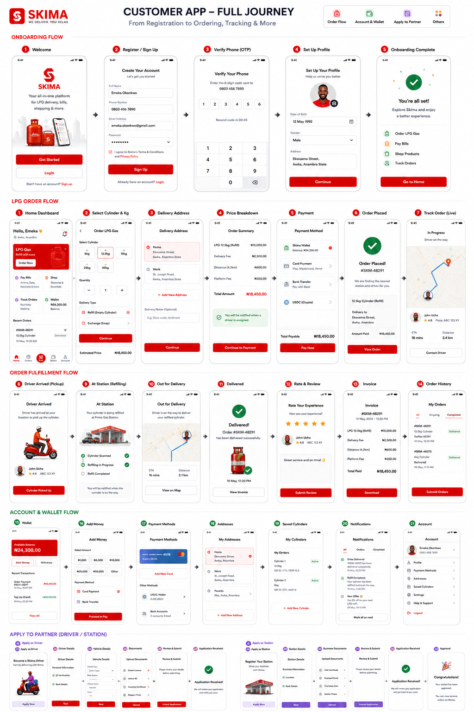
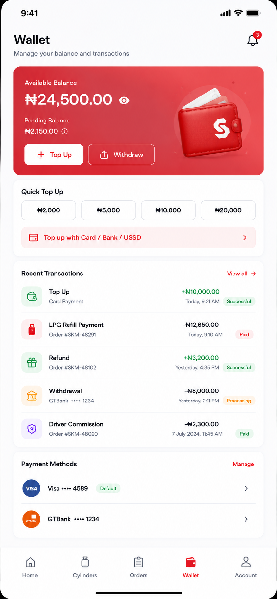
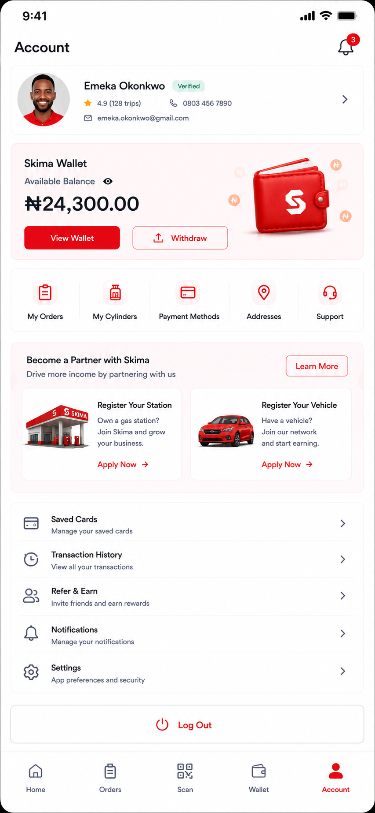

# Customer LPG Experience

Current status: In Progress.

The customer experience is a focused LPG refill app. It must not show food, ride, courier,
marketplace, or other service categories during Phase 1.

## Navigation

Customer bottom navigation:

- Home
- Cylinders
- Orders
- Wallet
- Account

The center scan action may remain available if the customer has a valid scan use case, such as
registering a cylinder or verifying delivery. It must not replace the five primary customer tabs
unless the product flow explicitly requires it.

## Onboarding Flow

Reference: customer full journey, screens 1-5.

Required screens:

- Welcome
- Register / Sign Up
- Verify Phone (OTP)
- Set Up Profile
- Onboarding Complete

Required behavior:

- use Supabase Auth for account creation and session state
- use backend OTP runtime for in-app OTP retrieval only where policy permits it
- collect only the minimum profile information needed to start using LPG
- clearly explain that the app is for LPG refills, bills, wallet, orders, and cylinder tracking
- show progress visually across the setup steps
- no developer words such as runtime, gateway, RPC, manifest, or policy keys

## Home Screen

Purpose: make the next LPG action obvious.

Required content:

- Skima LPG header
- notification and support icons
- greeting with customer name
- delivery location selector
- primary LPG refill hero showing the preferred cylinder
- estimated refill amount
- primary `Refill Now` action
- active order card when an order is in progress
- route/map preview for active order
- assigned driver summary
- quick actions: Refill Cylinder, Register Cylinder, Top Up Wallet, Support, Safety Tips
- My Cylinders preview
- wallet balance preview
- recent refill preview

Backend dependencies:

- `/runtime/session-context`
- `/lpg/locations`
- `/lpg/cylinders`
- `/lpg/orders/active`
- `/wallets`
- `/engines/currencies`
- `/lpg/maps/route-estimate`

Production behavior:

- if no cylinder exists, hero becomes a register-cylinder call to action
- if no saved address exists, location selector opens address setup
- if active order exists, it must show current workflow status and ETA
- amounts format with backend-enabled currency rules
- map preview must use backend-normalized route data

## Cylinders Screen

Purpose: manage LPG cylinder identity, inspection, QR, and refill readiness.

Required content:

- title and subtitle
- scan/QR shortcut
- notification icon
- register cylinder banner with product imagery
- cylinder list cards with image, size, id, color, brand, verification state
- last refill date
- next inspection date
- QR action per cylinder
- safety reminder card

Backend dependencies:

- `/lpg/cylinders`
- `/lpg/cylinders/history`
- `/lpg/scans`
- Media/Storage engine for cylinder images

Production behavior:

- unverified cylinders cannot be used for paid refill until allowed by policy
- inspection-due cylinders show warning state and safety prompt
- QR payloads must be generated and verified through the Verification Engine
- cylinder registration must validate size, identifier, brand, color, and ownership rules

## Refill Order Flow

Reference: customer full journey, LPG order flow screens 1-7.

Required steps:

1. Home dashboard.
2. Select cylinder and requested kilogram amount.
3. Select or create delivery address.
4. Review price breakdown.
5. Choose payment method.
6. Confirm order placed.
7. Track order live.

Required behavior:

- selected cylinder must belong to the signed-in customer or be authorized by policy
- requested kg cannot exceed configured cylinder capacity
- delivery address must be a saved location or a validated new location
- pricing must come from backend quote execution, not frontend calculation
- payment must use wallet/deposit/payment-provider APIs
- order creation must reserve funds through escrow before fulfilment
- order placed screen must show station/driver assignment state honestly

Backend dependencies:

- `/lpg/quotes`
- `/lpg/orders`
- `/finance/deposits`
- `/payment-initialize-api` or current finance gateway route
- `/wallets`
- `/lpg/maps/route-estimate`
- `/runtime/events`

## Orders Screen

Purpose: track active and historical LPG orders with clear fulfilment state.

Required content:

- Active, Completed, Cancelled tabs
- current order state
- ETA chip
- horizontal progress stepper
- route/map panel
- station summary
- driver summary with contact actions
- cylinder summary
- paid amount
- order timeline
- support action
- live tracking action

Backend dependencies:

- `/lpg/orders`
- `/lpg/orders/active`
- `/tracking`
- `/lpg/maps/route-estimate`
- `/communication/messages`
- `/verification/events`

Production behavior:

- order states mirror Workflow Engine transitions
- the customer cannot manually move an order to completed
- support actions create auditable support or safety records
- completed orders expose invoice and review entry points

## Fulfilment Screens

Reference: customer full journey, order fulfilment screens 8-14.

Required screens:

- Driver Arrived
- At Station / Refilling
- Out For Delivery
- Delivered
- Rate And Review
- Invoice
- Order History

Required behavior:

- driver arrival is backed by tracking and workflow events
- station refill state is backed by cylinder scan and refill confirmation
- delivery verification uses OTP/QR according to active policy
- rating writes to the review/audit model
- invoice displays ledger-backed totals
- duplicate completion events must not duplicate settlement or commission

## Wallet Screen

Purpose: show real wallet state and customer-controlled financial actions.

Required content:

- available balance
- pending/reserved balance
- top-up action
- withdrawal action where policy allows
- quick top-up amounts
- payment-method action
- transaction list
- saved payment methods

Backend dependencies:

- `/wallets`
- `/finance/deposits`
- `/finance/withdrawals`
- `/finance/transactions`
- `/engines/currencies`

Production behavior:

- balances must come from ledger-backed wallet data
- top-up initializes payment through configured provider adapter
- withdrawal eligibility is backend-policy controlled
- customer cannot see platform, station, or driver wallets

## Account Screen

Preferred account layout:

Purpose: profile, support, settings, and route into partner applications.

Required content:

- profile card
- verification badge
- phone and email
- wallet card
- quick links: My Orders, My Cylinders, Payment Methods, Addresses, Support
- Become a Partner section
- Register Your Station
- Register Your Vehicle / Apply as Driver
- saved cards
- transaction history
- refer and earn
- notifications
- settings
- logout

Backend dependencies:

- `/runtime/session-context`
- `/applications`
- `/documents`
- `/organization-members`
- `/profiles`
- `/wallets`

Production behavior:

- partner application cards only appear when the user is eligible
- role switcher appears only after backend approval grants access
- settings include light/dark/system mode and backend-enabled currency display choices
- logout clears local session and cached sensitive data

