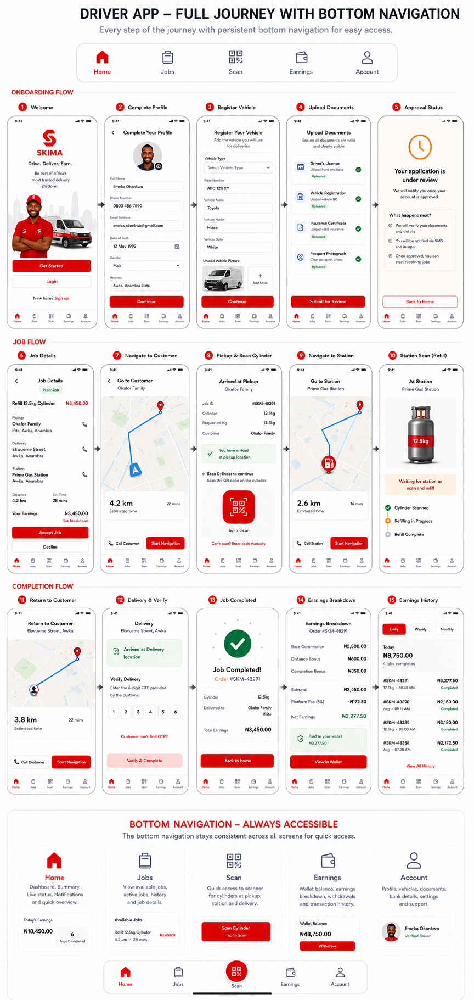
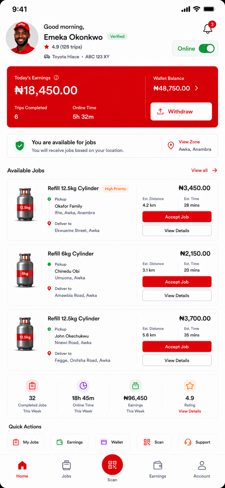

# Driver LPG Experience

Current status: In Progress.

The driver experience is built for approved drivers who can perform LPG-compatible work. Drivers
may later support other service categories, but Phase 1 UI focuses on LPG refill jobs.

## Navigation

Driver bottom navigation:

- Home
- Jobs
- Scan
- Earnings
- Account

The center scan tab is always visible for approved drivers because scanning is part of pickup,
station, and delivery verification.

## Driver Onboarding

Reference: driver full journey, onboarding screens 1-5.

Required screens:

- Welcome
- Complete Profile
- Register Vehicle
- Upload Documents
- Approval Status

Required behavior:

- customers may apply to become drivers from the account screen
- driver profile creation must not activate dispatch eligibility
- vehicle type, plate, make, model, color, and documents are required according to backend policy
- documents upload through Media/Storage engine paths
- application state is controlled by the Driver Application Engine and Workflow Engine
- approval screen must clearly say the driver cannot receive jobs until approval

Backend dependencies:

- `/applications`
- `/documents`
- `/driver-application-api` or current application gateway routes
- `/vehicles`
- `/driver-capabilities`
- `/runtime/session-context`

## Home Screen

Purpose: show driver availability, earnings, and available LPG jobs.

Required content:

- profile image and greeting
- verified driver badge
- rating and trip count
- assigned vehicle summary
- online/offline toggle
- notification icon
- today's earnings card
- wallet balance and withdraw action
- availability status card
- service zone card
- available jobs list
- weekly summary metrics
- quick actions

Backend dependencies:

- `/runtime/session-context`
- `/drivers`
- `/vehicles`
- `/assignments`
- `/lpg/orders`
- `/wallets`
- `/finance/withdrawals`
- `/lpg/driver-locations`

Production behavior:

- online toggle updates driver availability through backend policy
- driver only sees jobs for approved capabilities and approved vehicle
- accept job action must be idempotent and permission checked
- earnings must come from commission/ledger records

## Job Flow

Reference: driver full journey, job flow screens 6-10.

Required screens:

- Job Details
- Navigate To Customer
- Pickup And Scan Cylinder
- Navigate To Station
- Station Scan / Waiting For Refill

Required behavior:

- job detail shows pickup, delivery, station, distance, estimated time, and expected earnings
- accepting a job creates or claims an assignment through backend dispatch runtime
- navigation screens consume normalized backend map route data
- customer pickup requires QR or manual fallback only when policy permits
- station scan waits for station confirmation before continuing

Backend dependencies:

- `/lpg/orders/accept-assignment`
- `/lpg/orders/dispatch`
- `/lpg/scans`
- `/lpg/maps/route-estimate`
- `/lpg/driver-locations`
- `/runtime/events`

## Completion Flow

Reference: driver full journey, completion screens 11-15.

Required screens:

- Return To Customer
- Deliver And Verify
- Job Completed
- Earnings Breakdown
- Earnings History

Required behavior:

- driver location updates run through Tracking Engine
- delivery verification uses customer OTP/QR from backend Verification Engine
- job completion triggers workflow events
- driver commission is calculated from the active commission/settlement policy
- earnings breakdown must show gross, fees, bonuses, and net amount
- duplicate completion attempts must not pay commission twice

Backend dependencies:

- `/lpg/driver-locations`
- `/lpg/scans`
- `/otp`
- `/wallets`
- `/finance/transactions`
- `/settlements`
- `/commissions`

## Earnings Screen

Purpose: let drivers understand and withdraw earned money.

Required content:

- wallet balance
- available and pending earnings
- withdrawal action
- daily/weekly/monthly filters
- transaction list
- order-level earnings breakdown
- deductions and bonuses
- payout status

Production behavior:

- available balance is ledger-backed
- withdrawal button respects policy, limits, KYC, and settlement holds
- failed withdrawals show clear retry or support path

## Account Screen

Purpose: manage driver profile, vehicle, documents, bank details, settings, and support.

Required content:

- profile summary
- verification state
- active vehicle
- capabilities
- documents
- bank account / payout destination
- service zones
- availability settings
- support
- light/dark/system appearance preference
- backend-enabled currency preference
- logout

Production behavior:

- expired documents reduce or suspend eligibility according to backend policy
- vehicle changes may require admin approval before dispatch uses them
- account actions are permission checked by backend

