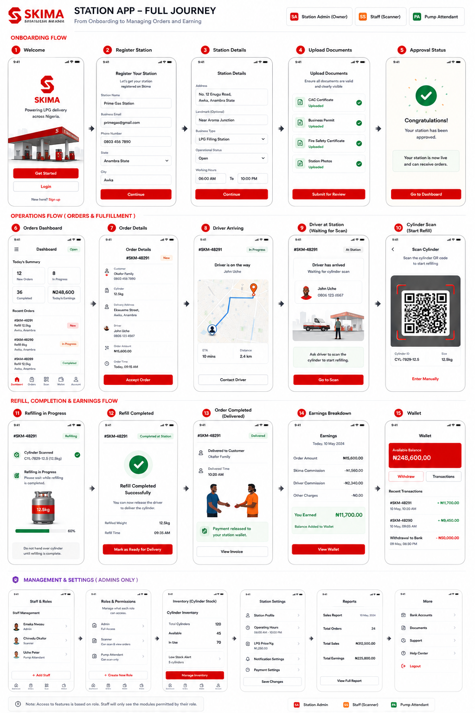
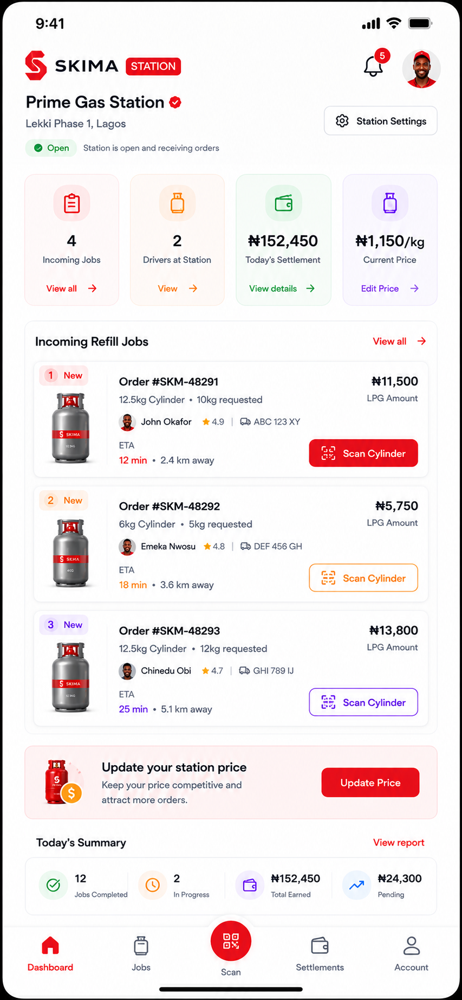
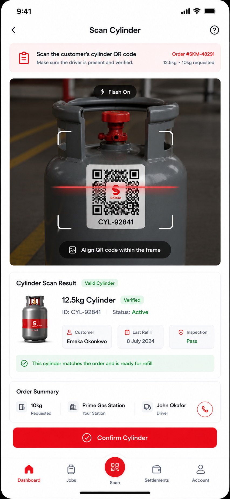
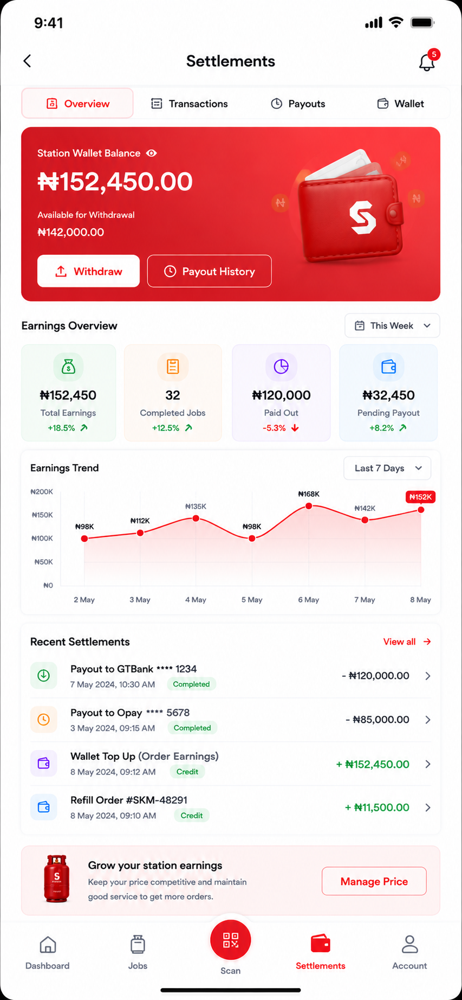
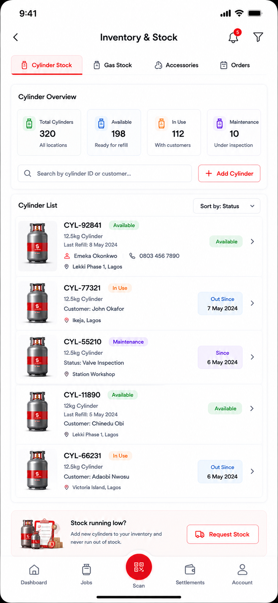
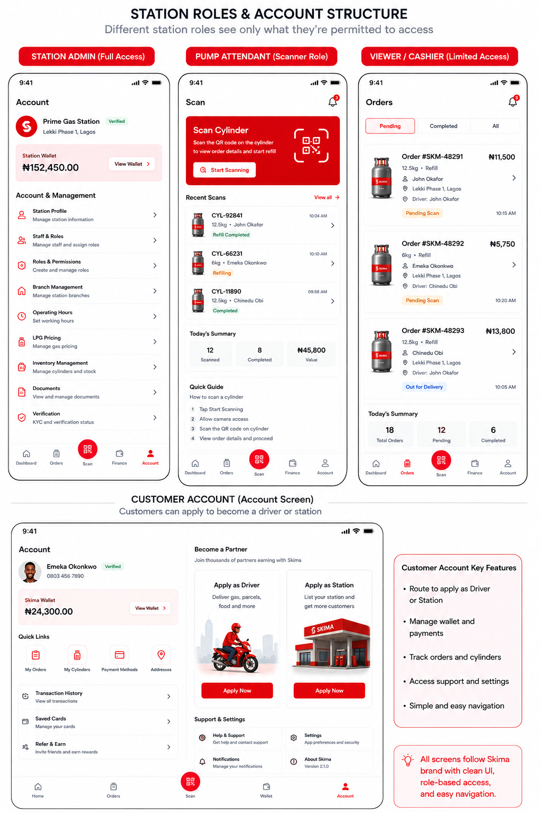

# Station LPG Experience

Current status: In Progress.

The station experience supports approved LPG stations, their branches, staff roles, cylinder
scanning, refill operations, inventory, settlements, and station-level settings.

## Navigation

Station bottom navigation:

- Dashboard
- Jobs
- Scan
- Settlements
- Account

Some references label the finance tab as `Finance`. The Phase 1 product may display
`Settlements` for owner/admin roles and `Finance` for limited staff if backend policy requires it.

## Station Onboarding

Reference: station full journey, onboarding screens 1-5.

Required screens:

- Welcome
- Register Station
- Station Details
- Upload Documents
- Approval Status

Required behavior:

- customers may apply to register a station from the customer account screen
- station application does not create an active station until admin approval
- station details include address, landmark, business type, operational status, and working hours
- required documents come from backend configuration
- approval creates or activates partner organization and station branch records

Backend dependencies:

- `/applications`
- `/documents`
- `/organization-members`
- `/business-branches`
- `/runtime/session-context`

## Dashboard

Purpose: show station status and incoming LPG refill work.

Required content:

- Skima Station header
- station name and verification badge
- branch/location
- notification and profile entry
- open/closed status
- station settings action
- metric cards: incoming jobs, drivers at station, today's settlement, current price
- incoming refill jobs list
- update price prompt
- today's summary

Backend dependencies:

- `/runtime/session-context`
- `/lpg/orders`
- `/lpg/catalog`
- `/wallets`
- `/settlements`
- `/organization-members`

Production behavior:

- open/closed state comes from station availability policy
- price update is permission checked
- incoming jobs only show orders assigned to the station/branch
- limited staff cannot see settlement values unless permitted

## Job Details

Purpose: help station staff process an incoming refill safely.

Required content:

- driver arrival status
- order number and placed time
- cylinder size and requested kg
- customer contact summary
- delivery area
- paid status
- driver information and contact actions
- arrival ETA and route/map strip
- job timeline
- actions: Scan Cylinder, Report Issue

Backend dependencies:

- `/lpg/orders`
- `/lpg/scans`
- `/lpg/maps/route-estimate`
- `/communication/messages`
- `/lpg/safety-incidents`

Production behavior:

- paid state comes from escrow/payment status
- report issue creates an auditable safety/support incident
- scan action is hidden or disabled for roles without scan permission

## Scan Cylinder

Purpose: verify the customer cylinder before refill.

Required content:

- instruction card
- order number
- requested kg and cylinder size
- camera/scan surface
- flash control
- QR frame
- scan result panel
- cylinder identity, owner, last refill, inspection status
- order summary
- confirm cylinder action

Backend dependencies:

- `/lpg/scans`
- `/verification/events`
- `/lpg/cylinders`
- `/lpg/orders`

Production behavior:

- scan validates who scanned, what was scanned, why, where, and which workflow event follows
- invalid, mismatched, suspended, stolen, expired, or wrong-owner cylinders must block refill
- manual entry requires explicit backend permission and audit logging

## Refill And Completion

Reference: station full journey, refill/completion screens 11-15.

Required screens:

- Refilling In Progress
- Refill Completed
- Order Completed / Delivered
- Earnings Breakdown
- Wallet

Required behavior:

- station records actual refill kg and completion time
- completion event releases station settlement according to active policy
- driver commission remains tied to delivery completion policy
- earnings breakdown shows order amount, platform commission, driver commission, charges, and net
  station earnings
- wallet reflects ledger-backed balances

Backend dependencies:

- `/lpg/refills/confirm`
- `/settlements`
- `/wallets`
- `/finance/transactions`
- `/runtime/events`

## Settlements

Purpose: give station owners/admins confidence in money movement.

Required content:

- tabs: Overview, Transactions, Payouts, Wallet
- station wallet balance
- available for withdrawal
- withdraw action
- payout history action
- earnings overview metrics
- earnings trend
- recent settlements
- price management prompt

Backend dependencies:

- `/wallets`
- `/finance/transactions`
- `/finance/withdrawals`
- `/settlements`
- `/engines/currencies`

Production behavior:

- settlement values are hidden from scanner/pump attendant roles unless permitted
- withdrawal requires policy, KYC, bank beneficiary, limits, and audit logging
- charts are summaries of ledger-backed records

## Inventory And Stock

Purpose: manage cylinders, gas stock, accessories, and order stock operations.

Required content:

- tabs: Cylinder Stock, Gas Stock, Accessories, Orders
- cylinder overview metrics
- search by cylinder id or customer
- add cylinder action
- cylinder list with status, current owner/customer, location, and time out
- request stock prompt

Backend dependencies:

- `/lpg/cylinders`
- `/catalog`
- `/availability`
- `/media`
- `/documents`

Production behavior:

- stock actions are branch-scoped and permission checked
- unavailable stock cannot be sold
- cylinder custody changes must create history and audit records

## Station Management

Reference: station full journey, management and settings screens.

Required screens:

- Staff And Roles
- Roles And Permissions
- Inventory
- Station Settings
- Reports
- More

Required behavior:

- station admin/owner can invite staff and assign roles
- scanner role can scan and view assigned orders only
- pump attendant can process refill steps only where permitted
- cashier/viewer can view allowed orders and finance summaries only by policy
- owner/admin can manage branch hours, LPG price, notification settings, documents, and reports

Backend dependencies:

- `/organization-members`
- `/admin/users` only for platform admins, not station staff
- `/business-catalog`
- `/availability`
- `/documents`
- `/reports`

## Role Reference

Station role examples:

- Station Admin / Owner: full station access, staff, price, inventory, settlement, documents
- Staff / Scanner: scan cylinders, view assigned orders, limited order state updates
- Pump Attendant: refill execution, limited job status updates
- Viewer / Cashier: allowed order and finance views only

The role names are product labels. The backend remains the authority through organization
membership, roles, permissions, and branch restrictions.

