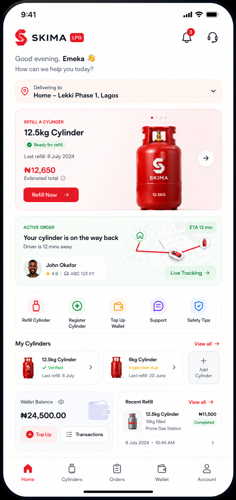
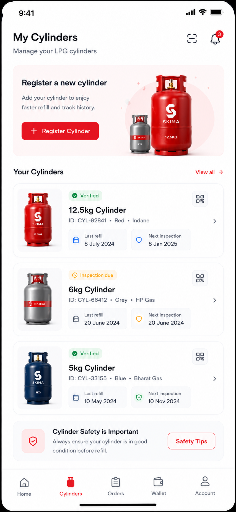
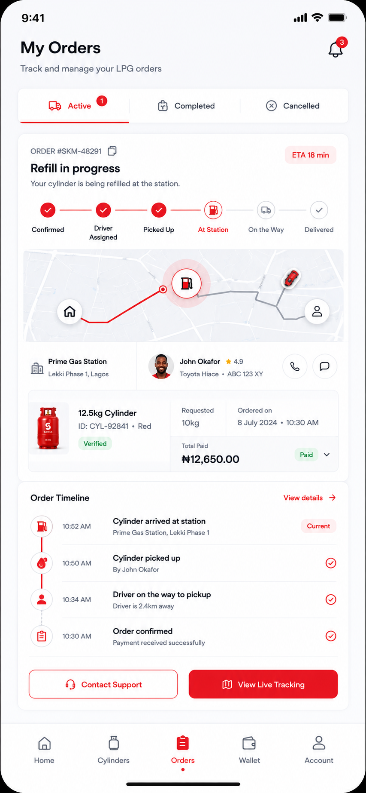
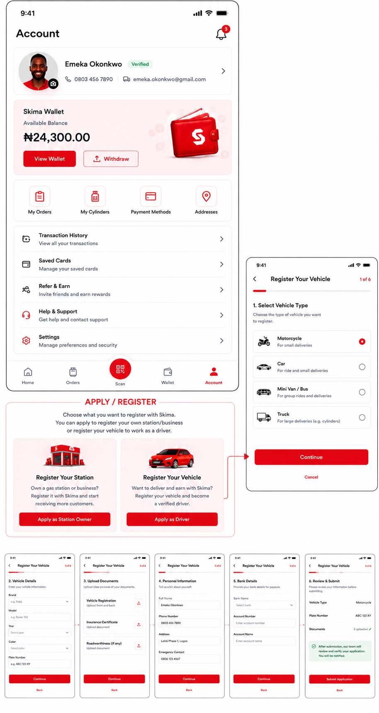
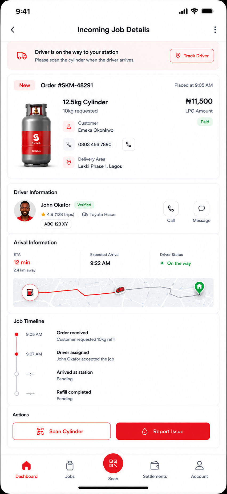

# Skima LPG UI Reference Pack

Current status: In Progress.

This folder is the visual and product contract for the Phase 1 LPG mobile experience. It preserves
the uploaded reference images and turns them into build requirements for customer, driver, and
station workspaces.

The old platform documents remain valid. This folder does not replace the platform constitution or
the reusable frontend architecture. It adds the LPG launch product layer that composes reusable
frontend primitives into a focused LPG experience.

## Product Rule

Phase 1 is LPG-first:

- customers see LPG refill, cylinders, orders, wallet, and account experiences
- drivers see LPG-compatible jobs, scanning, routing, earnings, and account experiences
- stations see LPG orders, cylinder scans, refill operations, settlements, stock, and staff
  experiences
- users may switch between customer, driver, station, and admin workspaces only when backend
  permissions allow it

The shared foundation must stay reusable:

- no LPG logic inside shared buttons, forms, navigation, wallet, map, QR, or API primitives
- LPG labels, flows, and composition live in the LPG product layer
- future modules can add their own product layer without rewriting the shared foundation

## Reference Images

| Area | Reference | Source intent |
| --- | --- | --- |
| Customer full journey |  | End-to-end customer onboarding, LPG order, fulfilment, wallet, account, and partner application flow |
| Customer home |  | LPG customer dashboard and active order composition |
| Customer cylinders |  | Cylinder registry, inspection state, QR entry point, and safety prompt |
| Customer orders |  | Active order tracking, timeline, map preview, driver and station details |
| Customer wallet |  | Wallet balance, top-up, withdrawal, transactions, and payment methods |
| Customer account |  | Profile, wallet, quick links, partner applications, support, and settings |
| Customer account option |  | Preferred account layout with partner registration cards |
| Driver full journey |  | Driver onboarding, job execution, scan, delivery OTP, earnings, and navigation |
| Driver home |  | Driver home, online state, available jobs, earnings, and quick actions |
| Station full journey |  | Station onboarding, order operations, refill, settlement, and admin-only settings |
| Station home |  | Station dashboard, incoming refill jobs, pricing prompt, and summary |
| Station job details |  | Incoming job, driver arrival, timeline, map strip, and action buttons |
| Station scan |  | Cylinder QR scanning, scan result, order summary, and confirmation |
| Station settlements |  | Earnings, wallet balance, payout history, trends, and settlements |
| Station inventory |  | Cylinder stock, gas stock, accessories, search, and stock actions |
| Role/account structure |  | Station roles, account permissions, and customer partner entry points |

## Documentation Map

- [Visual Standard](./00-visual-standard.md)
- [Customer Experience](./01-customer-experience.md)
- [Driver Experience](./02-driver-experience.md)
- [Station Experience](./03-station-experience.md)
- [Role Switching And Access](./04-role-switching-access.md)
- [Screen Build Backlog](./05-screen-build-backlog.md)

## Minimum Bar

The implementation must match the quality direction of these references:

- polished LPG product surfaces, not raw backend tables
- rich but clean cards with real product imagery
- clear red Skima brand accent on a mostly white/light interface
- dark mode equivalent using the same component system
- persistent bottom navigation per workspace
- scan action treated as a first-class center action where appropriate
- map, QR, wallet, order, and settlement surfaces designed as product experiences
- no visible developer/internal wording in customer, driver, or station UI

